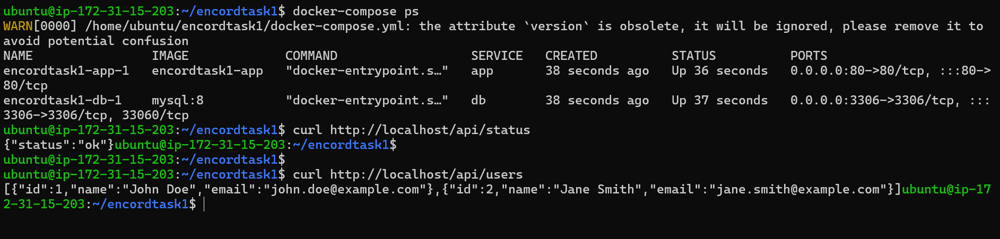

# Docker-Based Application

Step-by-Step Documentation for Docker-Based Application


## 1. Prerequisites

Before you begin, ensure that you have the following installed:

 - Docker
 - Docker Compose


## Docker 
Step 1: Update all Software Repositories using below command.

```bash
sudo apt-get update

```

Step 2: Install a Docker using below command.

```bash
sudo apt install docker.io -y

```
Step 3: Enable and start the docker service as follows.

```bash
sudo systemctl enable docker
sudo systemctl start docker

```

Step 4: Check the  docker version.

```bash
docker --version

```

You will get permison denied error as regular user dosn't have permisions to execute docker commands, add ubuntu user to docker group.

```bash
sudo usermod -aG docker $USER
     or 
sudo usermod -aG docker ubuntu

```
Exit From Current SSH Terminal & SSH(Login) again .Then execute

```bash
docker ps

```

## Docker Compose

Download the Docker Compose Binary:

```bash
VERSION=$(curl --silent "https://api.github.com/repos/docker/compose/releases/latest" | grep -oP '"tag_name": "\K(.*)(?=")')
sudo curl -L "https://github.com/docker/compose/releases/download/${VERSION}/docker-compose-$(uname -s)-$(uname -m)" -o /usr/bin/docker-compose

```

Apply Executable Permissions:
```bash
sudo chmod +x /usr/bin/docker-compose

```

Verify Installation:
```bash
docker-compose --version


```

## 2. Clone the Repository

Clone the repository to your local machine:

```bash
git clone https://github.com/asad059/DockerAppchallange1.git

```

Navigate to the project directory:
```bash
cd DockerAppchallange1

```
## 3. Configuration Files
**3.1. Dockerfile**
```bash
#node:18 is a good choice for a Node.js application, but if your application can work with a slimmer image like node:18-alpine, consider using it to reduce the image size
FROM node:18-alpine

# Set the working directory inside the container
WORKDIR /app

# Copy the package.json and package-lock.json to the working directory
COPY package*.json .

# Install the application dependencies
RUN npm install

# Copy the rest of the application code to the working directory
COPY . .

# Expose port 80 for the application
EXPOSE 80

# Set environment variables (these will be passed in during container run)
ENV DB_HOST=${DB_HOST}
ENV DB_USER=${DB_USER}
ENV DB_PASSWORD=${DB_PASSWORD}
ENV DB_NAME=${DB_NAME}

# Run the application
CMD ["npm", "start"]

```

**3.2. Docker Compose Configuration**
```bash
version: '3.8'
services:
  app:
    build: .
    env_file:
      - .env
    ports:
      - "80:80"
    depends_on:
      - db

  db:
    image: mysql:8
    ports:
      - "3306:3306"
    environment:
      MYSQL_ROOT_PASSWORD: ${MYSQL_ROOT_PASSWORD}
      MYSQL_DATABASE: ${MYSQL_DATABASE}
      MYSQL_USER: ${MYSQL_USER}
      MYSQL_PASSWORD: ${MYSQL_PASSWORD}
    volumes:
      - db-data:/var/lib/mysql
      - ./init.sql:/docker-entrypoint-initdb.d/init.sql:ro

volumes:
  db-data:
```
**3.3. Environment Variables**  
The .env file stores environment variables used by Docker Compose.  
* Create a file named .env in your project directory.  
* Add the following content:
```bash
# Application environment Variables

DB_HOST: db
DB_USER: encord
DB_PASSWORD: encord123
DB_NAME: app_db

# MYSQL environment Variables

MYSQL_ROOT_PASSWORD: rootpassword
MYSQL_DATABASE: app_db
MYSQL_USER: encord
MYSQL_PASSWORD: encord123
```
## 4. Build and Run the Containers
* Build and start the Docker containers:
```bash
docker-compose up --build
```
* Verify that the containers are running:
```bash
docker-compose ps
```
## 5. Verify Application

* Open your web browser and navigate to http://localhost to check if the application is running.
 Verify endpoints using curl:
  * Check the status of the app:
```bash
curl http://localhost/api/status

```
* Get the user list:
```bash
curl http://localhost/api/users
```
## 6. Troubleshooting
* Check container logs if you encounter issues:
```bash
docker-compose logs app
docker-compose logs db

```
* Restart containers if necessary:
```bash
docker-compose down
docker-compose up --build

```

## Output


